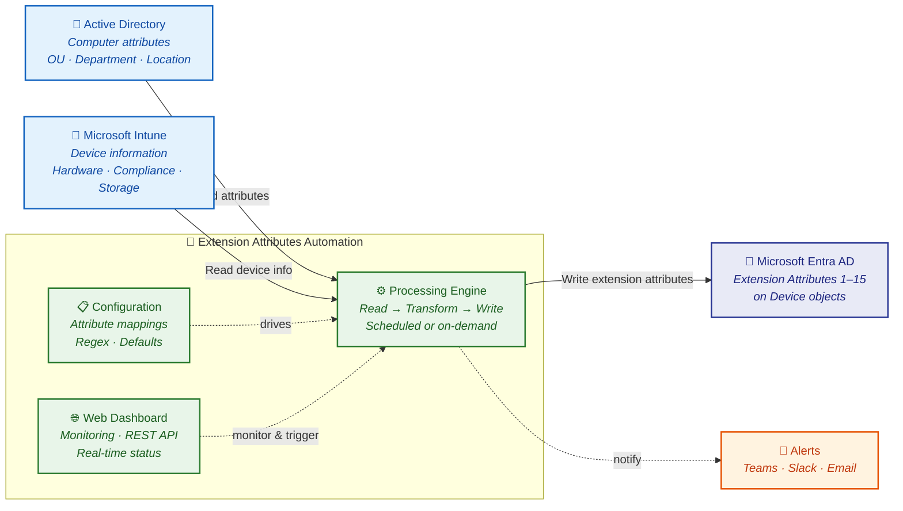

```mermaid
graph LR
    %% ===== DATA SOURCES =====
    AD["🏢 Active Directory<br/><i>Computer attributes<br/>OU · Department · Location</i>"]
    Intune["📱 Microsoft Intune<br/><i>Device information<br/>Hardware · Compliance · Storage</i>"]

    %% ===== WORKER SERVICE =====
    subgraph Worker["🔧 Extension Attributes Automation"]
        direction TB
        Config["📋 Configuration<br/><i>Attribute mappings<br/>Regex · Defaults</i>"]
        Engine["⚙️ Processing Engine<br/><i>Read → Transform → Write<br/>Scheduled or on-demand</i>"]
        Dashboard["🌐 Web Dashboard<br/><i>Monitoring · REST API<br/>Real-time status</i>"]
    end

    %% ===== TARGET =====
    EntraAD["🔷 Microsoft Entra AD<br/><i>Extension Attributes 1–15<br/>on Device objects</i>"]

    %% ===== NOTIFICATIONS =====
    Alerts["📢 Alerts<br/><i>Teams · Slack · Email</i>"]

    %% ===== CONNECTIONS =====
    AD -->|Read attributes| Engine
    Intune -->|Read device info| Engine
    Config -.->|drives| Engine
    Engine -->|Write extension attributes| EntraAD
    Engine -.->|notify| Alerts
    Dashboard -.->|monitor & trigger| Engine

    %% ===== STYLING =====
    classDef source fill:#e3f2fd,stroke:#1565c0,stroke-width:2px,color:#0d47a1
    classDef target fill:#e8eaf6,stroke:#283593,stroke-width:2px,color:#1a237e
    classDef worker fill:#e8f5e9,stroke:#2e7d32,stroke-width:2px,color:#1b5e20
    classDef alert fill:#fff3e0,stroke:#e65100,stroke-width:2px,color:#bf360c

    class AD,Intune source
    class EntraAD target
    class Config,Engine,Dashboard worker
    class Alerts alert
```

