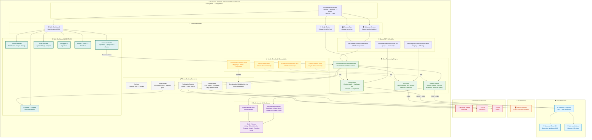

```mermaid
graph TB
    %% ===== EXTERNAL SYSTEMS =====
    subgraph External["☁️ Cloud Services"]
        EntraAD["🔷 Microsoft Entra AD<br/><i>Extension Attributes 1-15</i>"]
        GraphAPI["🌐 Microsoft Graph API<br/><i>v1.0 + beta endpoints</i>"]
        Intune["📱 Microsoft Intune<br/><i>Managed Devices</i>"]
    end

    subgraph OnPrem["🏢 On-Premises"]
        AD["🖥️ Active Directory<br/><i>LDAP / DirectoryServices</i>"]
    end

    subgraph Notifications["📢 Notification Channels"]
        Teams["💬 Microsoft Teams<br/><i>Webhook</i>"]
        Slack["💬 Slack<br/><i>Webhook</i>"]
        Email["📧 Email<br/><i>SMTP</i>"]
    end

    %% ===== MAIN APPLICATION =====
    subgraph Worker["🔧 Extension Attributes Automation Worker Service<br/><i>.NET 10 LTS — Windows Service / Console / Web App</i>"]

        %% --- Entry Point ---
        subgraph Entry["🚀 Entry Point — Program.cs"]
            CLI["CommandLineService<br/><i>--service · --webapp · --device<br/>--dry-run · --help</i>"]
        end

        %% --- Execution Modes ---
        subgraph Modes["⚡ Execution Modes"]
            ServiceMode["🪟 Windows Service<br/><i>Background scheduled</i>"]
            ConsoleMode["🖥️ Console App<br/><i>Manual execution</i>"]
            WebMode["🌐 Web Dashboard<br/><i>http://localhost:5000</i>"]
            DeviceMode["🎯 Single Device<br/><i>Debug / troubleshoot</i>"]
        end

        %% --- Scheduling ---
        subgraph Scheduling["📅 Quartz.NET Scheduler"]
            UnifiedJob["SetUnifiedExtensionAttributeJob<br/><i>CRON: every 5 min</i>"]
            ADJob["SetComputerExtensionAttributeJob<br/><i>Legacy — AD only</i>"]
            IntuneJob["SetIntuneExtensionAttributeJob<br/><i>Legacy — Intune only</i>"]
        end

        %% --- Core Processing ---
        subgraph Core["⚙️ Core Processing Engine"]
            Unified["UnifiedExtensionAttributeHelper<br/><i>Orchestrates all data sources</i>"]
            ADHelper["ADHelper<br/><i>LDAP queries · DN parsing<br/>Attribute extraction</i>"]
            EntraHelper["EntraADHelper<br/><i>Device lookup · Get/Set<br/>Extension Attributes (beta)</i>"]
            IntuneHelper["IntuneHelper<br/><i>Device details · Hardware info<br/>Software · Compliance</i>"]
        end

        %% --- Authentication & Resilience ---
        subgraph Auth["🔐 Authentication & Resilience"]
            AuthHandler["AuthenticationHandler<br/><i>Certificate / Client Secret<br/>Thread-safe token cache</i>"]
            Polly["Polly Policies<br/><i>Retry · Circuit Breaker<br/>Timeout · Graph Throttling (429)</i>"]
            GraphClient["GraphServiceClient<br/><i>Azure.Identity</i>"]
        end

        %% --- Web Layer ---
        subgraph Web["🌐 Web Dashboard & REST API"]
            HomeCtrl["HomeController<br/><i>Dashboard · Login · Config</i>"]
            StatusCtrl["StatusController<br/><i>/api/status · /api/process-device</i>"]
            AuditCtrl["AuditController<br/><i>/api/audit/logs · /export</i>"]
            SignalR["AuditHub — SignalR<br/><i>Real-time events</i>"]
            Swagger["Swagger UI<br/><i>/api-docs</i>"]
            HealthUI["Health Checks UI<br/><i>/health-ui</i>"]
        end

        %% --- Monitoring ---
        subgraph Monitoring["🩺 Health Checks & Observability"]
            HC_Config["ConfigurationHealthCheck<br/><i>Mappings · Paths · Duplicates</i>"]
            HC_Entra["EntraADHealthCheck<br/><i>Graph API connectivity</i>"]
            HC_AD["ActiveDirectoryHealthCheck<br/><i>LDAP connectivity</i>"]
            HC_Intune["IntuneHealthCheck<br/><i>Intune API connectivity</i>"]
        end

        %% --- Cross-cutting ---
        subgraph CrossCut["📋 Cross-Cutting Concerns"]
            Serilog["Serilog<br/><i>Console · File · CMTrace</i>"]
            Audit["AuditLogger<br/><i>25+ event types · SignalR push</i>"]
            Notify["NotificationService<br/><i>Teams · Slack · Email</i>"]
            Export["ExportHelper<br/><i>CSV export · CsvHelper<br/>Daily append mode</i>"]
            ConfigValid["ConfigurationValidationService<br/><i>Startup validation</i>"]
        end
    end

    %% ===== CONNECTIONS =====

    %% Entry → Modes
    CLI --> ServiceMode
    CLI --> ConsoleMode
    CLI --> WebMode
    CLI --> DeviceMode

    %% Modes → Scheduling
    ServiceMode --> UnifiedJob
    ConsoleMode --> UnifiedJob
    DeviceMode --> Unified

    %% Scheduling → Core
    UnifiedJob --> Unified
    ADJob --> ADHelper
    IntuneJob --> IntuneHelper

    %% Core orchestration
    Unified --> ADHelper
    Unified --> EntraHelper
    Unified --> IntuneHelper

    %% Core → External
    ADHelper -->|LDAP| AD
    EntraHelper -->|REST + SDK| GraphAPI
    IntuneHelper -->|REST + SDK| GraphAPI
    GraphAPI --> EntraAD
    GraphAPI --> Intune

    %% Auth flow
    EntraHelper --> AuthHandler
    IntuneHelper --> GraphClient
    AuthHandler --> Polly
    GraphClient --> Polly

    %% Web → Core
    WebMode --> HomeCtrl
    WebMode --> StatusCtrl
    WebMode --> AuditCtrl
    WebMode --> SignalR
    WebMode --> Swagger
    WebMode --> HealthUI
    StatusCtrl -->|Process device| Unified

    %% Monitoring
    HC_Config -.->|validate| ConfigValid
    HC_Entra -.->|test| EntraHelper
    HC_AD -.->|test| ADHelper
    HC_Intune -.->|test| IntuneHelper

    %% Cross-cutting → External
    Notify --> Teams
    Notify --> Slack
    Notify --> Email

    %% Audit flow
    Unified --> Audit
    Audit --> SignalR
    Unified --> Export

    %% Styling
    classDef external fill:#e1f5fe,stroke:#0288d1,stroke-width:2px,color:#01579b
    classDef onprem fill:#fff3e0,stroke:#e65100,stroke-width:2px,color:#bf360c
    classDef notify fill:#fce4ec,stroke:#c62828,stroke-width:2px,color:#b71c1c
    classDef core fill:#e8f5e9,stroke:#2e7d32,stroke-width:2px,color:#1b5e20
    classDef auth fill:#f3e5f5,stroke:#6a1b9a,stroke-width:2px,color:#4a148c
    classDef web fill:#e0f2f1,stroke:#00695c,stroke-width:2px,color:#004d40
    classDef monitor fill:#fff9c4,stroke:#f9a825,stroke-width:2px,color:#f57f17
    classDef crosscut fill:#f5f5f5,stroke:#616161,stroke-width:1px,color:#212121

    class EntraAD,GraphAPI,Intune external
    class AD onprem
    class Teams,Slack,Email notify
    class Unified,ADHelper,EntraHelper,IntuneHelper core
    class AuthHandler,Polly,GraphClient auth
    class HomeCtrl,StatusCtrl,AuditCtrl,SignalR,Swagger,HealthUI web
    class HC_Config,HC_Entra,HC_AD,HC_Intune monitor
    class Serilog,Audit,Notify,Export,ConfigValid crosscut
```
